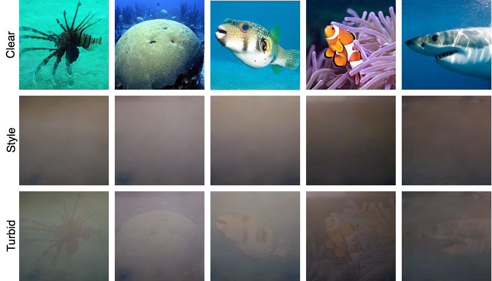
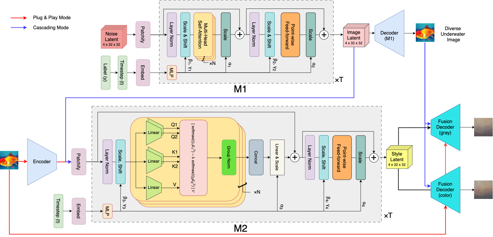
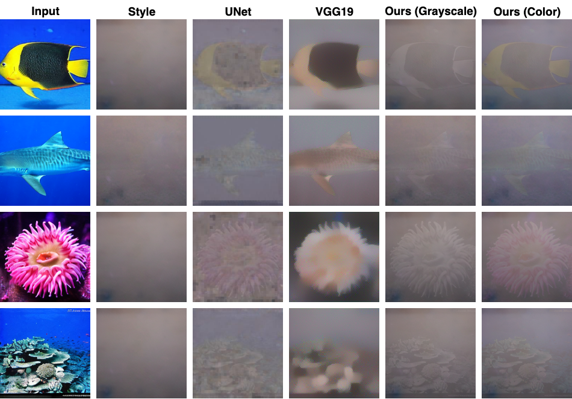
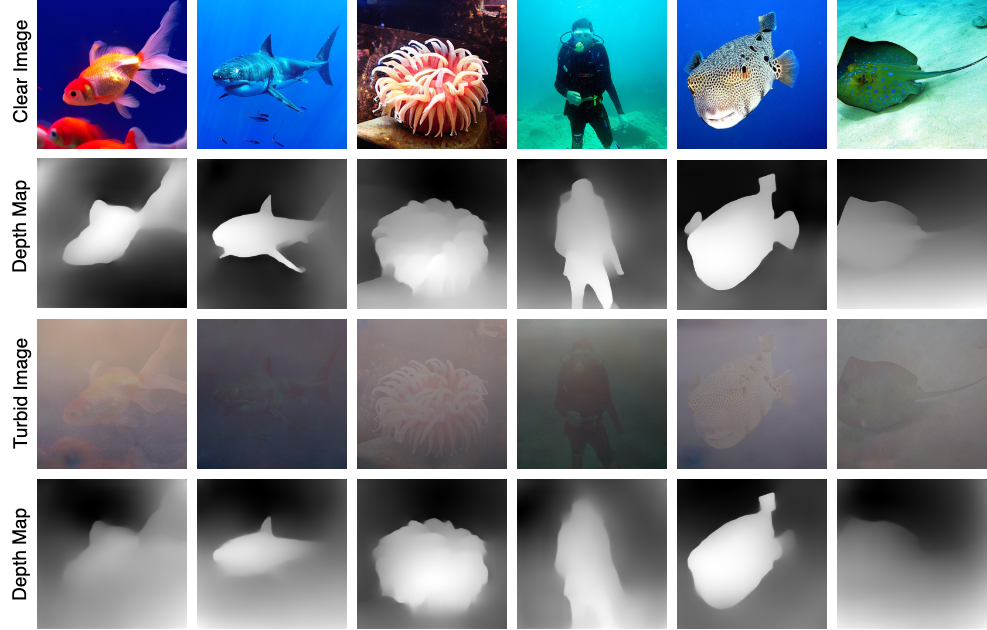
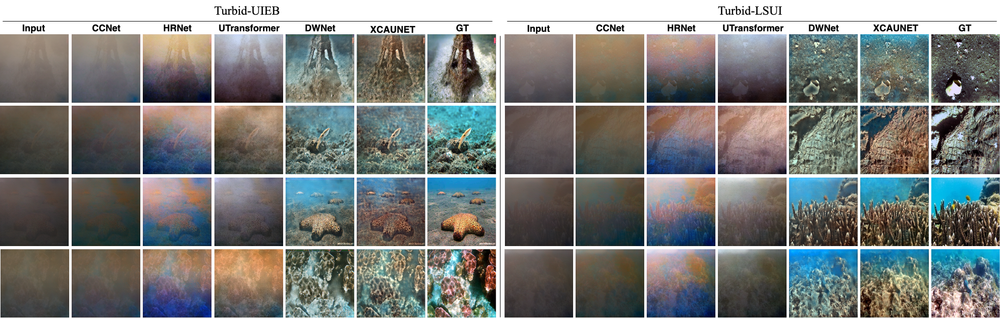

# TURBIT
## Datasets
The datasets are available at this [link](https://ieee-dataport.org/documents/turbid-underwater-image).</br></br>
</br></br></br>

## Architecture
1. **Proposed M1-M2 Architecture**</br></br>
</br></br></br>

## Results

2. **Analysis of Fusion Methods** </br>
</br></br></br>


3. **Depth Maps Results**   </br>
</br></br></br>


4. **UIE Evaluation on Turbid-UIEB and Turbid-LSUI**    </br>
</br></br></br>


 ## BibTeX
 ```
 @data{e7tm-0063-25,
doi = {10.21227/e7tm-0063},
url = {https://dx.doi.org/10.21227/e7tm-0063},
author = {SRIVASTAVA, UTKARSH and ROY, SOUMAJIT and PRAMANICK, ALIK and SUR, ARIJIT},
publisher = {IEEE Dataport},
title = {Turbid Underwater Image},
year = {2025} } 
```
	
